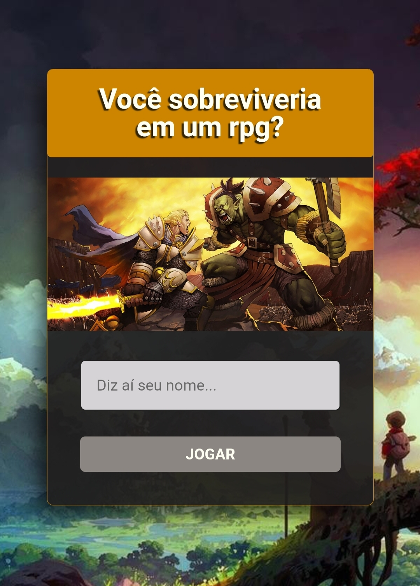

<div align="center">
	
    <h1>Quiz</h1>
</div>


## :dart: Objetivo

Com a proposta de nos mostrar como nextjs funciona, a [Alura](https://www.alura.com.br/) propôs a criação de uma aplicação para aplicar os conceitos desse framework que vem ganhando muito espaço no mercado nos útimos dias.
Foram 5 aulas do dia 25 ao 29, apresentando conceitos do React e Nextjs, como os instrutores trazendo sua visão de mercado e boas práticas.
Sendo assim a ideia é construir um app de perguntas e respostas, o famigerado Quiz. O tema do projeto é livre, e decidi fazer um quiz sobre RPG, banda que vem se popularizando a cada dia. Assim dando um quiz divertido para os amantes de RPG.

## :hammer_and_wrench: Ferramentas

-   [Nextjs](https://nextjs.org/)
-   [Styled Components](https://styled-components.com)
-   [Styled Icons](https://styled-icons.js.org/)
-   [Vercel](https://vercel.com)
-   [Yarn](https://yarnpkg.com/)

## :desktop_computer: Padronização de código

-   [Eslint](https://eslint.org/)
-   [Prettier](https://prettier.io/)
-   [EditorConfig](https://editorconfig.org/)

## :art: Animações

-   [Lottie](https://lottiefiles.com/)
-   [Motion](https://www.framer.com/motion/)

## :rocket: Executando o projeto

```bash
git clone https://github.com/Matheus153/quizWithNext.git ou git@github.com:Matheus153/quizWithNext.git

// Concluindo a instalação rode

yarn dev
```

## Autor 


### |Matheus Santos|

## :eyeglasses: Demo em produção

[Link de acesso :dizzy:](https://quiz-srnovato.vercel.app/)